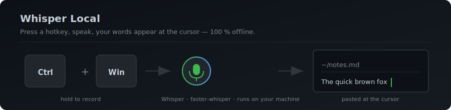

# Whisper Local — Free, Private, AI Dictation for Windows & macOS

> **Press a hotkey. Speak. Your words appear at the cursor.**
> No cloud, no subscription, no telemetry. Powered by [OpenAI Whisper](https://github.com/openai/whisper) running **100 % on your machine**.

[](https://github.com/drajb/whisper-local/actions/workflows/test.yml)
[](https://www.python.org/downloads/)
[](LICENSE)
[](#-quick-start)



<sub>Want a real screen-recording demo here? See [`docs/demo-recording.md`](docs/demo-recording.md) — drop a `docs/demo.gif` in and uncomment the line below.</sub>
<!--  -->


Whisper Local is a free, open-source **voice-to-text dictation tool** for power users who want **AI transcription without sending audio to the cloud**. Built around [`faster-whisper`](https://github.com/SYSTRAN/faster-whisper), it gives you **push-to-talk dictation in any application** — chat apps, code editors, browsers, terminals, design tools, anywhere a cursor blinks.

---

## 🌟 Why this exists

Most AI dictation tools are great — until you check the privacy policy. Your audio goes to a server, gets processed, and (sometimes) stored. You pay a monthly fee or get cut off.

Whisper Local exists because **you shouldn't have to choose between accuracy and privacy.**

- 🔒 Your voice never leaves your machine — not even metadata
- 🆓 Free forever — no account, no API key, no subscription
- 🔌 Works offline, air-gapped, after the internet is gone
- 🛠️ Fork it, hack it, ship your own version — MIT licensed
- 💡 Same Whisper model quality as cloud services, running on your own GPU

This is a **community tool**, not a product. There's no support SLA, no roadmap committee, no marketing. If it's useful to you, great. If something's broken, PRs are welcome.

---

## ✨ Why Whisper Local?

| | Whisper Local | Cloud dictation (Otter, Dragon Anywhere, etc.) | Windows Speech Recognition |
|---|:---:|:---:|:---:|
| Runs offline | ✅ | ❌ | ✅ |
| Audio never leaves your machine | ✅ | ❌ | partial |
| Free / open source | ✅ | ❌ | ✅ |
| Modern AI accuracy (Whisper) | ✅ | ✅ | ❌ |
| Works in any app via hotkey | ✅ | ❌ | partial |
| Customisable voice commands | ✅ | partial | ❌ |
| Push-to-talk + auto-paste + auto-send | ✅ | ❌ | ❌ |
| GPU acceleration (NVIDIA & AMD) | ✅ | n/a | ❌ |

---

## 🎯 Features

- 🎙️ **Global push-to-talk hotkey** — start recording from any app with `Ctrl+Win` (Windows) or `Fn+Ctrl` (macOS)
- ⚡ **Pre-roll buffer + warmup** — captures the 500 ms before you press the key *and* pre-loads Whisper at boot, so the first word is never clipped and the first recording feels instant
- 🔵 **Floating level overlay** — a small pill at the screen edge shows you're being heard, with the live streaming transcript appearing next to the level bar (Wispr Flow–style)
- 📝 **Inline voice formatting** — say "comma", "period", "question mark", "new paragraph", "open quote", etc. mid-sentence
- 🤖 **AI rephrase** — dedicated `Ctrl+Shift+Win` hotkey: select text, hold, speak your instruction, release — local Ollama rewrites it in place
- 🌐 **Translation mode** — speak any language, get English; tray → Profile → Translate
- 🔁 **Continuous dictation mode** — for long-form notes, the app auto-restarts recording after each delivery
- 📋 **Fallback window** — if no text field is focused, the transcript appears in a small window (pre-selected, copy button, already on clipboard)
- ⏸ **Pause-all hotkey** — `Ctrl+Alt+Win` disables every Whisper Local hotkey until you press it again
- 📋 **Auto-paste at cursor** — transcript lands wherever you're typing, optionally followed by Enter (auto-send)
- 🔒 **100 % local & private** — no network calls during use; Whisper models cached on disk
- 🚀 **GPU acceleration** — NVIDIA CUDA and AMD ROCm supported, CPU works out of the box
- 🗣️ **Voice commands** — say a trigger phrase to send a hotkey, type pre-written text, or run a shell command
- 🔁 **Hot-reload** — edit `commands.yaml` and your change applies on the next transcription, no restart
- 🩺 **Built-in diagnostics** — `whisper-local --doctor` checks audio devices, model cache, hotkeys, and recent errors
- 🎛️ **Profiles** — switch between Dictation / Chat / Code / Notes presets from the tray
- 🪟 **Per-app rules** — different behaviour per foreground app (auto-send in Slack, copy-only in VS Code, suppress in 1Password)
- 🧹 **Optional LLM cleanup** — pipe transcripts through a local [Ollama](https://ollama.ai) model for punctuation / capitalisation polish (off by default, fully local)
- 📜 **Recent transcriptions** — last 10 results in the tray menu, click to copy back
- 🔧 **Settings backup/restore** — `--export-settings` / `--import-settings` for portability
- 🖥️ **Settings UI** — `whisper-local --settings` opens a GUI settings window (no YAML editing required)
- 📜 **Transcript history** — `whisper-local --history` opens a searchable log of everything you've dictated
- 🔔 **Opt-in update notifications** — daily GitHub release check, fully offline by default (`update_check.enabled: true` to opt in)
- 🎚️ **Noise suppression** — spectral gating via `noisereduce`, off by default (`pip install 'whisper-local[noise]'`)
- 🛡️ **Crash reports** — uncaught errors write a self-contained dump to disk
- 🪟 **System tray UI** — model selection, mic selection, profile switch, diagnostics
- 🍎 **Cross-platform** — Windows 10+, macOS

---

## 🚀 Quick Start

### Install (Python 3.11–3.13)

```bash
git clone https://github.com/drajb/whisper-local.git
cd whisper-local
pip install -e .
```

### Launch

| | |
|---|---|
| **Terminal** | `whisper-local` (or `wl` for short) |
| **Double-click** | `whisper-local.cmd` (Windows) |
| **Start Menu / Startup** | Create a shortcut to `whisper-local.cmd`, drop it in `%APPDATA%\Microsoft\Windows\Start Menu\Programs\Startup\` for autostart |

First launch downloads the [`tiny`](https://huggingface.co/Systran/faster-whisper-tiny) Whisper model (~75 MB) into your HuggingFace cache. After that, **everything runs offline**.

### Use it

| Action | Windows | macOS |
|---|---|---|
| Hold to record | `Ctrl+Win` | `Fn+Ctrl` |
| Stop & paste | release key (push-to-talk) or `Ctrl` | release or `Fn` |
| Stop & auto-send (Enter) | `Alt` | `Option` |
| Cancel | `Esc` | `Shift` |
| Voice command mode | `Alt+Win` | `Fn+Command` |

### Verify everything works

```bash
whisper-local --doctor
```

Runs through Python version, dependencies, config validation, audio devices, model cache, hotkey backend, and recent log errors. Exit 0 = clean.

---

## 🗣️ Voice Commands

Speak a trigger to run keyboard shortcuts, type snippets, or launch programs. Defined in:

- **Windows:** `%APPDATA%\whisperkey\commands.yaml`
- **macOS:** `~/.whisperkey/commands.yaml`

```yaml
commands:
  # Send a keyboard shortcut
  - trigger: "undo"
    hotkey: "ctrl+z"

  # Deliver pre-written text
  - trigger: "my email"
    type: "user@example.com"

  # Run a shell command
  - trigger: "open notepad"
    run: 'notepad.exe'
```

Edits hot-reload — no app restart required. See **[docs/voice-commands.md](docs/voice-commands.md)** for the full guide.

> ⚠️ Voice commands with `run:` execute through your system shell with your user privileges. Only add commands you trust.

---

## ⚡ GPU Acceleration

On first launch, Whisper Local detects your GPU and offers one-press install of the required runtime libraries. Supports **NVIDIA CUDA** and **AMD ROCm**.

For manual setup or AMD RDNA 1, see **[docs/gpu-setup.md](docs/gpu-setup.md)**.

---

## 🎛️ Profiles

Switch between presets from the tray icon → **Profile**:

| Profile | Behaviour |
|---|---|
| **Dictation** | General-purpose voice typing, auto-paste on |
| **Chat** | Push-to-talk, auto-paste + auto-send via `Alt` |
| **Code** | Copy-only mode for editors, never auto-sends |
| **Notes** | Quiet copy-to-clipboard, voice commands disabled |

Edit or add new profiles in `%APPDATA%\whisperkey\profiles.yaml`.

---

## 🪟 Per-app rules

Different apps want different behaviour. Whisper Local detects the
foreground window before delivering each transcription and matches it
against rules in `%APPDATA%\whisperkey\app_rules.yaml`:

```yaml
rules:
  # Chat apps: send the message immediately
  - match: ["slack.exe", "discord.exe"]
    auto_send: true

  # Code editors: never auto-send, copy only
  - match: ["code.exe", "cursor.exe"]
    auto_paste: false

  # Password managers: skip delivery entirely
  - match: ["1password.exe", "bitwarden.exe"]
    suppress: true
```

Hot-reloads — edit and the next transcription picks it up.

## 🧹 Optional LLM cleanup

If you have [Ollama](https://ollama.ai) running locally, Whisper Local can
pipe each transcript through a small local model for punctuation and
capitalisation polish. **Off by default and fully local** — set
`postprocess.ollama.enabled: true` in `user_settings.yaml` to enable.

```yaml
postprocess:
  capitalize_first: true        # works without Ollama
  ensure_punctuation: true      # works without Ollama
  strip_filler_words: true      # works without Ollama
  ollama:
    enabled: false              # set true to opt in
    endpoint: http://localhost:11434
    model: llama3.2
    timeout: 5
```

## ⚙️ Configuration

Local settings live at:

- **Windows:** `%APPDATA%\whisperkey\user_settings.yaml`
- **macOS:** `~/.whisperkey/user_settings.yaml`

Delete the file and restart to reset to defaults. Highlights:

| Option | Default | Notes |
|---|---|---|
| `whisper.model` | `tiny` | Any model from `whisper.models`. Larger = more accurate, slower |
| `whisper.device` | `cpu` | `cpu` or `cuda` (NVIDIA/AMD) |
| `whisper.compute_type` | `int8` | `int8`/`float16`/`float32` |
| `whisper.language` | `auto` | Auto-detect or specific language code |
| `whisper.hotwords` | `[]` | Words the model should favour — names, jargon |
| `hotkey.recording_hotkey` | `ctrl+win` | Configurable |
| `hotkey.recording_mode` | `toggle` | `toggle` or `push_to_talk` |
| `vad.vad_realtime_enabled` | `true` | Auto-stop on silence |
| `clipboard.auto_paste` | `true` | `false` = copy only |
| `clipboard.delivery_method` | `paste` | `paste` (Ctrl+V) or `type` (direct injection) |
| `voice_commands.enabled` | `true` | Enable command mode |
| `audio.host` | `null` | `WASAPI` recommended on Windows for low latency |

Full reference: [`config.defaults.yaml`](src/whisper_key/config.defaults.yaml).

---

## 🛠️ CLI Reference

```bash
whisper-local                      # Run the app (or use `wl`)
whisper-local --setup              # Interactive setup wizard (model, mode, mic)
whisper-local --doctor             # Run diagnostics
whisper-local --stats              # Transcription history & time saved
whisper-local --version            # Print version
whisper-local --quit               # Stop the running instance
whisper-local --export-settings DIR        # Back up user_settings + commands
whisper-local --import-settings DIR        # Restore from a backup
whisper-local --export-transcripts FILE    # Dump history (.txt/.md/.csv)
whisper-local --import-vocab FOLDER        # Mine a folder for hotwords
whisper-local --settings           # Open the settings GUI (no YAML editing required)
whisper-local --history            # Browse and search transcript history
whisper-local --test               # Run a separate test instance (own mutex)
```

Launching while an instance is already running **takes over** — the old one is replaced cleanly, no manual quit needed.

---

## 🏗️ How it works

```
┌─────────────────────┐  ┌──────────────────┐  ┌─────────────────────┐
│  global-hotkeys /   │  │   sounddevice +  │  │  faster-whisper /   │
│  NSEvent (macOS)    │─▶│  500ms ring buf  │─▶│  ctranslate2 (GPU)  │
└─────────────────────┘  │  + TEN VAD       │  └──────────┬──────────┘
                         └──────────────────┘             │
                                                          ▼
                         ┌──────────────────┐  ┌─────────────────────┐
                         │  Voice command   │◀─│  Transcribed text   │
                         │  matcher         │  │                     │
                         └──────────────────┘  └──────────┬──────────┘
                                                          ▼
                                                ┌─────────────────────┐
                                                │  ctypes SendInput / │
                                                │  Quartz CGEvent     │
                                                │  → cursor           │
                                                └─────────────────────┘
```

---

## 🔒 Privacy pledge

Whisper Local makes the following network calls and **no others**:

1. **First launch only:** downloads the Whisper model from `huggingface.co` into your local cache.
2. **GPU onboarding (opt-in):** if you accept the GPU setup prompt, `pip install` pulls CUDA / ROCm runtime packages from PyPI / `repo.radeon.com`.

After setup, **zero network traffic**. Confirm by running `whisper-local --doctor` and inspecting the source — every network entry point lives in [`onboarding.py`](src/whisper_key/onboarding.py) and is gated behind explicit user prompts.

---

## 📦 Tech stack

`faster-whisper` · `ctranslate2` · `sounddevice` · `ten-vad` · `pyperclip` · `pystray` · `ruamel.yaml` · `playsound3`
**Windows-only:** `global-hotkeys` · `pywin32` · ctypes `SendInput`
**macOS-only:** `pyobjc-framework-Quartz` · `pyobjc-framework-ApplicationServices`

---

## 🤝 Contributing

Contributions of all kinds are welcome — bug fixes, new features, docs improvements, or just opening an issue with a clear reproduction. This project is maintained on a best-effort basis with no SLA; please be patient with response times.

```bash
git clone https://github.com/drajb/whisper-local.git
pip install -e .
python -m unittest tests.test_smoke   # all 28 should pass
```

See [CONTRIBUTING.md](CONTRIBUTING.md) for details. By contributing you agree your code will be MIT licensed.

---

## ☕ Support

Whisper Local is free and always will be. If it saves you time or a monthly subscription, consider starring the repo and sharing it with people who'd find it useful — it helps the project grow.

No pressure. Starring the repo and sharing it with people who'd find it useful is just as helpful.

---

## 🙏 Credit

Forked from [whisper-key-local](https://github.com/PinW/whisper-key-local) by Pin Wang. MIT licensed; original copyright preserved in [`LICENSE`](LICENSE).
